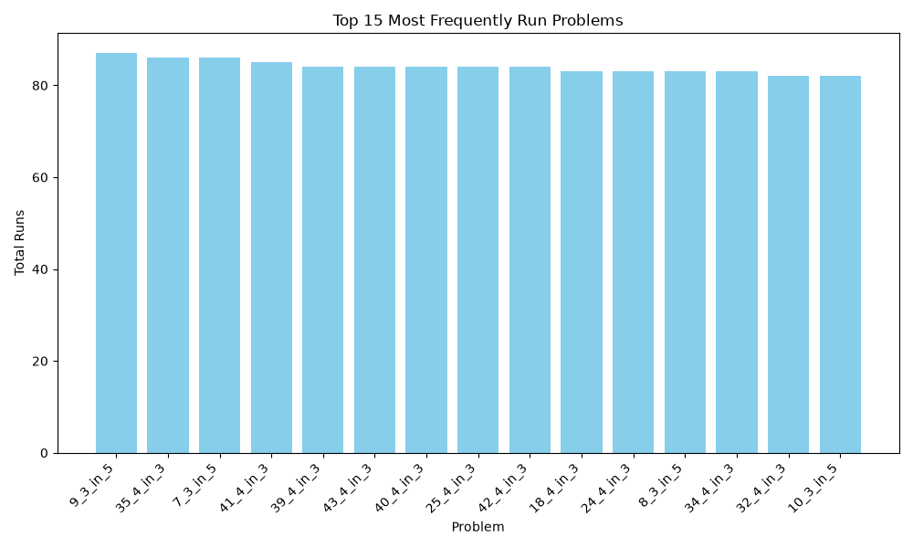
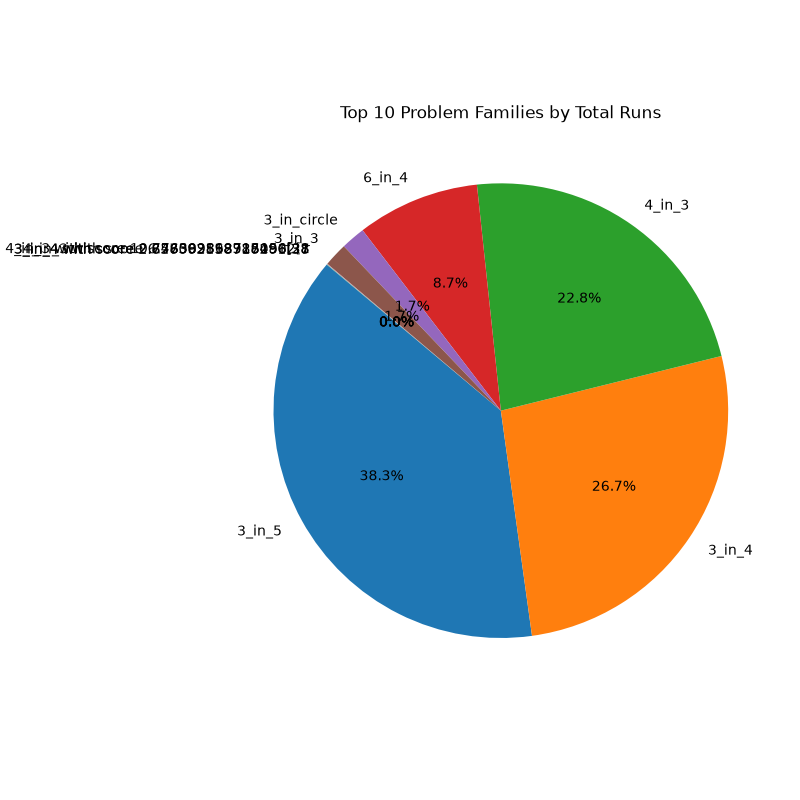
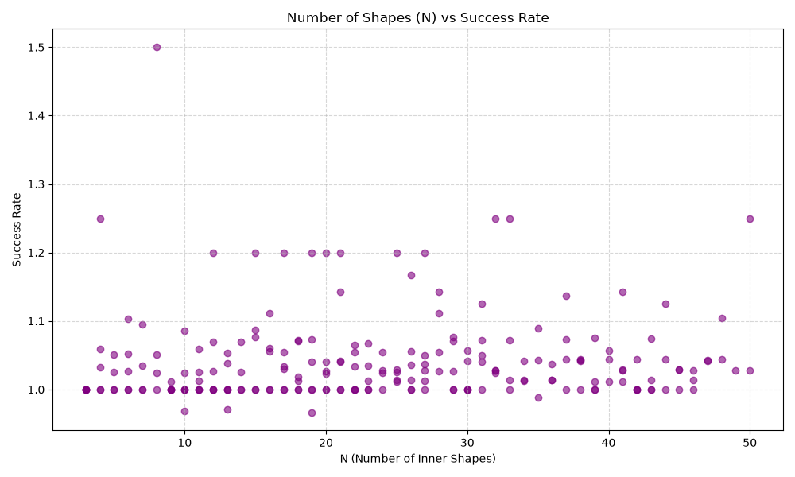

# Mill Log Analysis Report

## High-Level Summary
- **Total Unique Problems Run:** 553
- **Total Individual Attempts (Starts):** 9184
- **Total Successes Found:** 9151
- **Overall Success Rate:** 99.64%

## Visualizations

### Most Frequently Run Problems

### Distribution by Problem Family

### Difficulty Scaling (N vs Success Rate)

## Top 10 Best Improvements (Lowest Score)
| Problem | Total Runs | Success Rate | Best Score |
|---------|------------|--------------|------------|
| 3_3_in_circle | 8 | 100.0% | 0.190118 |
| 4_3_in_circle | 4 | 125.0% | 0.219506 |
| 7_3_in_circle | 6 | 100.0% | 0.290413 |
| 8_3_in_circle | 6 | 150.0% | 0.310496 |
| 9_3_in_circle | 5 | 100.0% | 0.329329 |
| 10_3_in_circle | 6 | 100.0% | 0.347097 |
| 11_3_in_circle | 6 | 100.0% | 0.364198 |
| 12_3_in_circle | 5 | 100.0% | 0.380759 |
| 13_3_in_circle | 5 | 100.0% | 0.397289 |
| 14_3_in_circle | 5 | 100.0% | 0.413086 |
