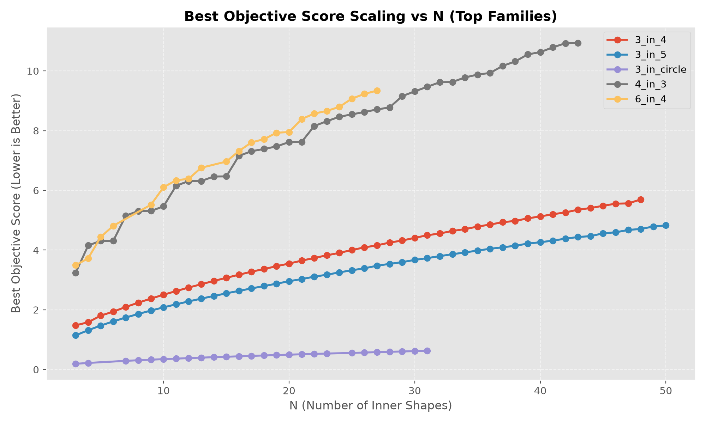
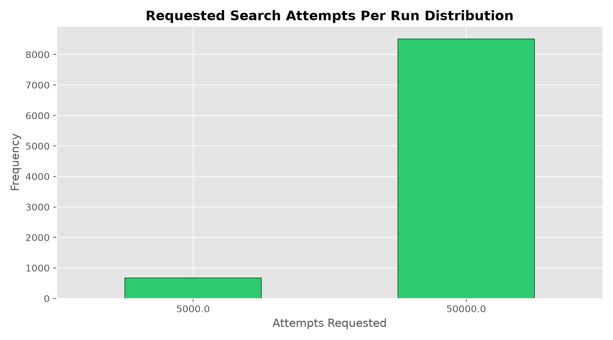

# Advanced Shape Packing Log Analysis Report

**Target Log File:** `results\mill-2330986.out`  
**Generated On:** `2026-07-28 20:57:06`

---

## 1. High-Level Executive Summary

| Metric | Value |
| :--- | :--- |
| **Total Unique Problems Evaluated** | `211` |
| **Total Parallel Runs Executed** | `9184` |
| **Total Solver Attempts Requested** | `428,915,000` |
| **Total Successful Improvements** | `9152` |
| **Overall Success Rate** | `99.65%` |
| **Distinct Problem Families** | `6` |

### Global Objective Score Statistics
- **Minimum Score (Best Found):** `0.190118`
- **Mean Best Score:** `4.672322`
- **Median Best Score:** `4.437767`
- **Maximum Best Score:** `10.938599`

---

## 2. Visual Analytics & Charts

### A. Most Frequently Run Problems

### B. Problem Family Workload Distribution

### C. Scaling & Difficulty: Problem Size (N) vs. Success Rate

### D. Objective Score Growth Across Shapes (N)

### E. Distribution of Search Attempts Requested Per Run

---

## 3. Problem Family Breakdown

Aggregated metrics across shape categories:

| Family | Total Problems | Total Runs | Total Compute Attempts | Avg Success Rate | Best Score Range |
| :--- | :--- | :--- | :--- | :--- | :--- |
| **3_in_5** | 48.0 | 3522.0 | 164,535,000 | 100.0% | 1.144 - 4.827 |
| **3_in_4** | 46.0 | 2435.0 | 120,985,000 | 100.0% | 1.478 - 5.695 |
| **4_in_3** | 41.0 | 2101.0 | 95,150,000 | 98.7% | 3.232 - 10.939 |
| **6_in_4** | 22.0 | 806.0 | 33,280,000 | 99.2% | 3.492 - 9.340 |
| **3_in_circle** | 26.0 | 164.0 | 7,345,000 | 100.0% | 0.190 - 0.625 |
| **3_in_3** | 28.0 | 156.0 | 7,620,000 | 100.0% | 2.977 - 7.740 |

---

## 4. Top 20 Best Improvements (Lowest Score)

The best packing density configurations discovered during execution:

| Problem | Family | N | Total Runs | Success Rate | Best Score | Avg Score |
| :--- | :--- | :--- | :--- | :--- | :--- | :--- |
| `3_3_in_circle` | `3_in_circle` | 3 | 8 | 100.0% | **0.190118** | 0.190145 |
| `4_3_in_circle` | `3_in_circle` | 4 | 5 | 100.0% | **0.219506** | 0.219540 |
| `7_3_in_circle` | `3_in_circle` | 7 | 6 | 100.0% | **0.290413** | 0.290429 |
| `8_3_in_circle` | `3_in_circle` | 8 | 9 | 100.0% | **0.310496** | 0.310550 |
| `9_3_in_circle` | `3_in_circle` | 9 | 5 | 100.0% | **0.329329** | 0.329427 |
| `10_3_in_circle` | `3_in_circle` | 10 | 6 | 100.0% | **0.347097** | 0.347391 |
| `11_3_in_circle` | `3_in_circle` | 11 | 6 | 100.0% | **0.364198** | 0.364489 |
| `12_3_in_circle` | `3_in_circle` | 12 | 5 | 100.0% | **0.380759** | 0.381202 |
| `13_3_in_circle` | `3_in_circle` | 13 | 5 | 100.0% | **0.397289** | 0.397635 |
| `14_3_in_circle` | `3_in_circle` | 14 | 5 | 100.0% | **0.413086** | 0.413487 |
| `15_3_in_circle` | `3_in_circle` | 15 | 6 | 100.0% | **0.426854** | 0.428139 |
| `16_3_in_circle` | `3_in_circle` | 16 | 5 | 100.0% | **0.441747** | 0.443520 |
| `17_3_in_circle` | `3_in_circle` | 17 | 6 | 100.0% | **0.455359** | 0.457862 |
| `18_3_in_circle` | `3_in_circle` | 18 | 6 | 100.0% | **0.470927** | 0.472311 |
| `19_3_in_circle` | `3_in_circle` | 19 | 6 | 100.0% | **0.484392** | 0.485340 |
| `20_3_in_circle` | `3_in_circle` | 20 | 5 | 100.0% | **0.497084** | 0.498440 |
| `21_3_in_circle` | `3_in_circle` | 21 | 5 | 100.0% | **0.510380** | 0.511952 |
| `22_3_in_circle` | `3_in_circle` | 22 | 5 | 100.0% | **0.523970** | 0.524597 |
| `23_3_in_circle` | `3_in_circle` | 23 | 9 | 100.0% | **0.533794** | 0.536089 |
| `25_3_in_circle` | `3_in_circle` | 25 | 6 | 100.0% | **0.556538** | 0.559990 |

---

## 5. Highest Volume Problems (Most Compute Workload)

Problems consuming the most total search iterations:

| Problem | Total Runs | Total Attempts | Success Rate | Best Score |
| :--- | :--- | :--- | :--- | :--- |
| `18_4_in_3` | 90 | 4,500,000 | 98.9% | 7.387785 |
| `9_3_in_5` | 88 | 4,400,000 | 100.0% | 1.974600 |
| `41_4_in_3` | 87 | 4,350,000 | 98.9% | 10.790949 |
| `31_4_in_3` | 86 | 4,300,000 | 98.8% | 9.469128 |
| `35_4_in_3` | 86 | 4,300,000 | 98.8% | 9.877529 |
| `40_4_in_3` | 86 | 4,300,000 | 98.8% | 10.629170 |
| `39_4_in_3` | 86 | 4,300,000 | 98.8% | 10.553857 |
| `27_6_in_4` | 86 | 4,300,000 | 98.8% | 9.340448 |
| `25_4_in_3` | 86 | 4,300,000 | 98.8% | 8.545164 |
| `24_4_in_3` | 86 | 4,300,000 | 98.8% | 8.465628 |
| `32_4_in_3` | 85 | 4,250,000 | 98.8% | 9.622120 |
| `43_4_in_3` | 85 | 4,250,000 | 98.8% | 10.938599 |
| `36_4_in_3` | 85 | 4,250,000 | 98.8% | 9.932988 |
| `34_4_in_3` | 85 | 4,250,000 | 98.8% | 9.781118 |
| `27_4_in_3` | 85 | 4,250,000 | 98.8% | 8.710055 |
| `8_3_in_5` | 85 | 4,250,000 | 100.0% | 1.861668 |
| `42_4_in_3` | 85 | 4,250,000 | 98.8% | 10.926857 |
| `10_3_in_5` | 84 | 4,200,000 | 100.0% | 2.081378 |
| `11_3_in_5` | 82 | 4,100,000 | 100.0% | 2.183118 |
| `13_3_in_5` | 81 | 4,050,000 | 100.0% | 2.373565 |

---

## 6. Hardest Problems (Lowest Success Rates)

Problems with the lowest ratio of successful improvements:

| Problem | Total Runs | Successes | Success Rate | Best Score |
| :--- | :--- | :--- | :--- | :--- |
| `21_4_in_3` | 25 | 24 | 96.0% | 7.623675 |
| `28_4_in_3` | 25 | 24 | 96.0% | 8.778031 |
| `38_4_in_3` | 26 | 25 | 96.2% | 10.317800 |
| `24_6_in_4` | 28 | 27 | 96.4% | 8.796581 |
| `26_4_in_3` | 28 | 27 | 96.4% | 8.625701 |
| `30_4_in_3` | 29 | 28 | 96.6% | 9.315449 |
| `19_4_in_3` | 30 | 29 | 96.7% | 7.470690 |
| `19_6_in_4` | 30 | 29 | 96.7% | 7.929378 |
| `16_6_in_4` | 31 | 30 | 96.8% | 7.315018 |
| `10_4_in_3` | 32 | 31 | 96.9% | 5.464132 |
| `9_6_in_4` | 32 | 31 | 96.9% | 5.518155 |
| `6_4_in_3` | 33 | 32 | 97.0% | 4.309500 |
| `9_4_in_3` | 33 | 32 | 97.0% | 5.309911 |
| `13_6_in_4` | 34 | 33 | 97.1% | 6.757237 |
| `12_4_in_3` | 38 | 37 | 97.4% | 6.309487 |
| `3_4_in_3` | 42 | 41 | 97.6% | 3.232052 |
| `8_4_in_3` | 42 | 41 | 97.6% | 5.309407 |
| `27_4_in_3` | 85 | 84 | 98.8% | 8.710055 |
| `32_4_in_3` | 85 | 84 | 98.8% | 9.622120 |
| `34_4_in_3` | 85 | 84 | 98.8% | 9.781118 |
